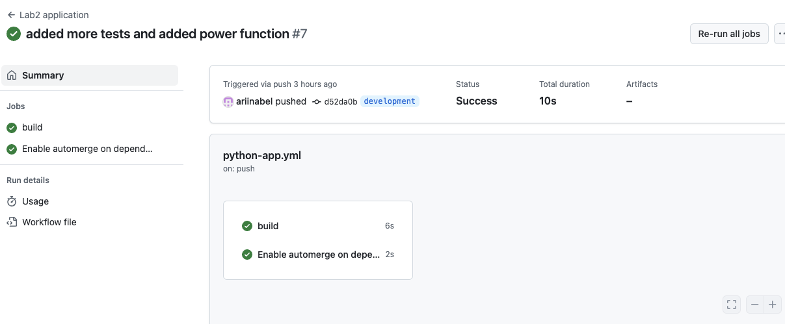

# Лабораторная работа 2

1) Создайте файл с названием main.yml в папке github/workflows/ вашего репозитория и определите в нем шаги вашего CI/CD процесса.

> Файл назвали test-and-docs.yml

Содержимое:
```yaml

name: Combined CI/CD

on:
  push:
    branches: ["main", "development"]
  pull_request:
    branches: ["main", "development"]

jobs:
  build-app:
    runs-on: ubuntu-latest
    steps:
      - uses: actions/checkout@v4

      - name: Set up Python
        uses: actions/setup-python@v5
        with:
          python-version: "3.x"

      - name: Install dependencies
        run: |
          pip install -r requirements.txt -r requirements-dev.txt

      - name: Run tests
        run: pytest

  build-docs:
    runs-on: ubuntu-latest
    steps:
      - uses: actions/checkout@v4

      - name: Set up Python
        uses: actions/setup-python@v5
        with:
          python-version: "3.x"

      - name: Install documentation dependencies
        run: pip install -r requirements-dev.txt

      - name: Build documentation
        run: mkdocs build

      - name: Deploy to GitHub Pages
        # if: github.ref == 'refs/heads/main'
        uses: peaceiris/actions-gh-pages@v3
        with:
          github_token: ${{ secrets.GITHUB_TOKEN }}
          publish_dir: ./site
          keep_files: false
          user_name: "ariinabel"
          user_email: "arina_belyakova04@mail.ru"

  automerge:
    needs: [build-app, build-docs]
    runs-on: ubuntu-latest
    # if: |
    #   github.event_name == 'pull_request' &&
    #   github.event.pull_request.user.login == 'dependabot[bot]'
    permissions:
      contents: write
      pull-requests: write
    steps:
      - name: Enable auto-merge
        uses: peter-evans/enable-pull-request-automerge@v3
        with:
          token: ${{ secrets.GITHUB_TOKEN }}
          pull-request-number: ${{ github.event.pull_request.number }}
          merge-method: squash
```

2) Проверка работы CI: после отправки изменений в репозиторий перейдите во вкладку Actions на GitHub. Отобразите в отчете список запущенных CI/CD workflow и их статус. Проверьте логи выполнения шагов вашего CI/CD.


3) Настройте CI таким образом, чтобы он автоматически запускался
при каждом новом коммите в ваш репозиторий.

Нужно в CI/CD скрипт добавить:

```yaml
on:
  push:
    branches: ["main", "development"]
  pull_request:
    branches: ["main", "development"]
```

4) Добавьте скрипты для тестирования вашего проекта (например, unit-тесты,интеграционные тесты) и убедитесь, что они успешно проходят
при запуске через СІ.

[Код тестов](https://github.com/ariinabel/lab_2/blob/main/test/test_calculator.py) 

```python
import pytest
from src.calculator import Calculator

@pytest.fixture
def calc():
    return Calculator()

@pytest.mark.parametrize("a, b, expected", [
    (2, 3, 5),
    (0, 0, 0),
    (-1, 1, 0),
])
def test_addition(calc, a, b, expected):
    assert calc.add(a, b) == expected

@pytest.mark.parametrize("a, b, expected", [
    (7, 2, 5),
    (10, 10, 0),
    (-1, -1, 0),
])
def test_subtraction(calc, a, b, expected):
    assert calc.subtract(a, b) == expected

@pytest.mark.parametrize("a, b, expected", [
    (3, 4, 12),
    (0, 5, 0),
    (-2, 3, -6),
])
def test_multiplication(calc, a, b, expected):
    assert calc.multiply(a, b) == expected
```

Лог тестов:


5) Создайте ветвь development для разработки новых функций и исправлений.

```sh
git checkout -b development
```

6) Разработайте новую функцию или исправление ошибки в вашем проекте и закоммитите изменения в ветвь development.

```sh
git add .
git commit -m "added more tests and added power function"
git push origin development
```

7) Убедитесь, что Cl успешно запустился после коммита в ветвь development и прошел все тесты.



8) Создайте Pull Request (PR) для вливания изменений из ветви development в основную ветвь (например, main). Настройте автоматическое тестирование и слияние PR при успешном прохождении всех тестов.

Для примера была создана ветка `test` и замержена в `main`
Проверьте, что изменения из ветви development успешно влились в основную ветвь с помощью CI/CD.


9) Создайте ветвь release для подготовки к выпуску новой версии вашего проекта.

```sh
git checkout -b release
```

Подготовьте все необходимые изменения (например, обновление версии, исправление багов) в ветвь release.


Убедитесь, что CI успешно запустился после коммита в ветвь release
и все тесты прошли успешно.
Создайте новый тег для версии вашего проекта и опубликуйте его
на платформе Git.
Создайте документацию к вашему проекту и добавьте ее в репози-
торий.
Настройте автоматическую генерацию документации при каждом
обновлении кода через CI/CD.
Проверьте, что документация успешно обновляется при каждом из-
менении кода.
Заключите текущую версию проекта и завершите работу над лабо-
раторной работой.